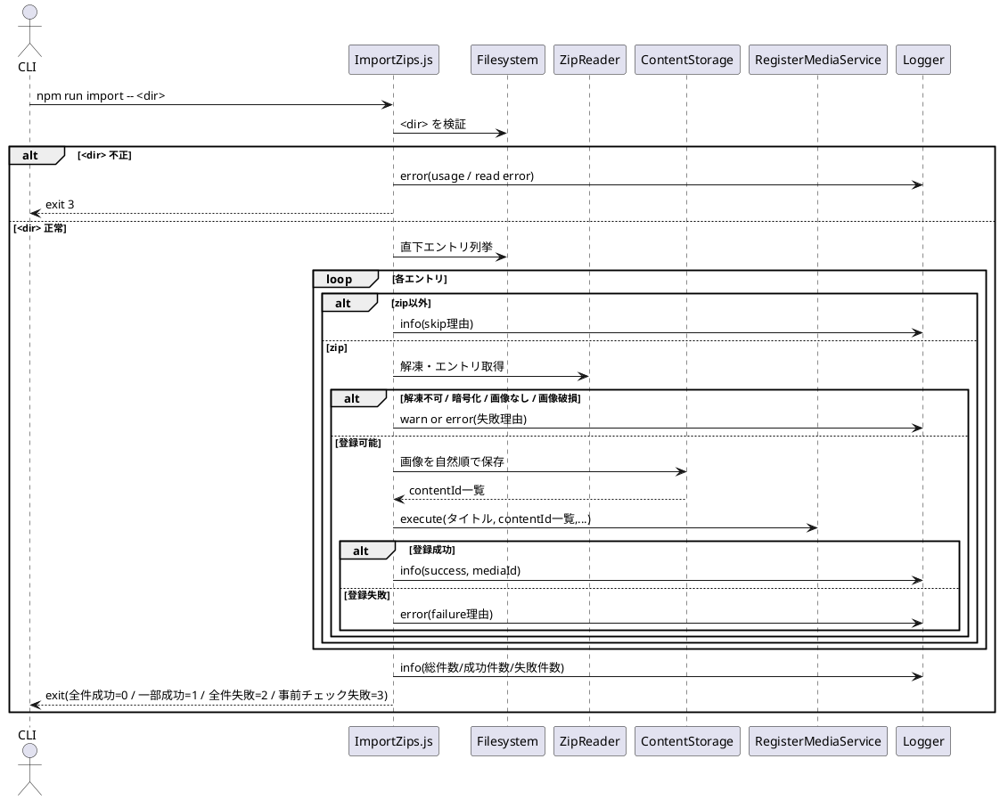

# ImportZips 設計書

## 概要
- `npm run import -- <dir>` で `scripts/ImportZips.js` を実行し、`<dir>` 直下の zip を一括でメディア登録する。
- 1 zip = 1 メディアとして扱う。
- 既存の `RegisterMediaService` と既存インフラを流用し、HTTP 前提の処理に依存しない CLI バッチとして実装する。

## 対象実装
- `scripts/ImportZips.js`
- `package.json` (`import` script 追加)
- 必要に応じて `src/app/createDependencies.js` から利用可能な依存オブジェクトを参照する。

## 設計方針
- **ImportZipsService は新設しない**。
  - 理由: 本ユースケースの中核は「zip の検証・抽出・並び替え・ログ出力」という CLI 固有オーケストレーションであり、既存 `RegisterMediaService` の責務（1メディア登録）を再利用すれば十分なため。
- DB 操作は既存 `UnitOfWork` を利用し、zip 単位で登録を完了/失敗として扱う。
- zip ごとの失敗は処理継続し、全体終了時にサマリを出力する。
- `<dir>` の読取不能・不存在は全体即時失敗とする。

## CLI 仕様

### 入力
- 引数: `<dir>`
  - 相対パスは `process.cwd()` 基準で解決する。

### 事前チェック
- `<dir>` 未指定: usage を表示して終了コード3。
- `<dir>` が存在しない / 読取不可: エラーログを出力して終了コード3。

### 探索対象
- `<dir>` **直下のみ**を走査する（再帰なし）。
- zip 判定は `/\.[zZ][iI][pP]$/`。
- 直下の zip 以外（ファイル/ディレクトリ）はスキップし、理由付きログを出力する。

## zip ごとの処理仕様

### 1. 正常性チェック
- 解凍ライブラリがエラーを返した場合は失敗。
- 暗号化 zip は非対応として失敗（暗号化であることをログ出力）。
- zip 内の対象は **直下エントリのみ**（zip 内ディレクトリ配下は対象外）。
- 画像判定は拡張子で行う（大文字小文字は区別しない）。
  - 許可拡張子: `.jpe`, `.jpeg`, `.png`, `.gif`, `.webp`, `.bmp`。
- 画像以外のエントリは無視し、**ファイルごとに 1 行**ログを出力する。
- 有効画像が 1 枚もなければ失敗。
- 画像の破損チェックは ImportZips 側で実施し、1 枚でも破損があれば zip 全体を失敗。

### 2. 順序
- 画像はファイル名（basename）で自然順ソートして登録順とする。
- 大文字小文字は区別する。

### 3. メディア登録
- タイトルは `{zipファイル名(拡張子除去)}`。
- 同名タイトルの重複チェックは不要。
- 同一 zip の再 import も毎回新規登録扱い。
- コンテンツ保存処理は既存実装に合わせる。
- DB 操作は zip 単位で完了/失敗を扱う（既存 UnitOfWork 方針に準拠）。

### 4. 結果ログ
- 成功/失敗に関わらず zip ごとに結果を出力する。
- 失敗時は可能な限り理由を出力する。
- 必須ログ項目
  - zipファイル名
  - 結果（success/failure）
  - 理由（failure時）
  - 無視ファイル一覧（該当時）
  - 登録content件数 / mediaId（成功時）
- ログレベル
  - `info`: 通常進行・成功・サマリ
  - `warn`: zip 不備（画像なし、非対応形式、非画像ファイル無視 等）
  - `error`: 読み取り失敗、保存失敗、予期せぬ例外

### 5. 全体終了コード
- 全件成功: 0
- 一部成功: 1
- 全件失敗: 2
- 事前チェック失敗（引数不正 / 対象dir読取不可）: 3

## シーケンス図

## 関連ドキュメント
- [RegisterMediaService 設計書](/doc/4_application/media/command/RegisterMediaService/readme.md)
- [createDependencies 設計書](/doc/4_application/app/createDependencies/readme.md)
