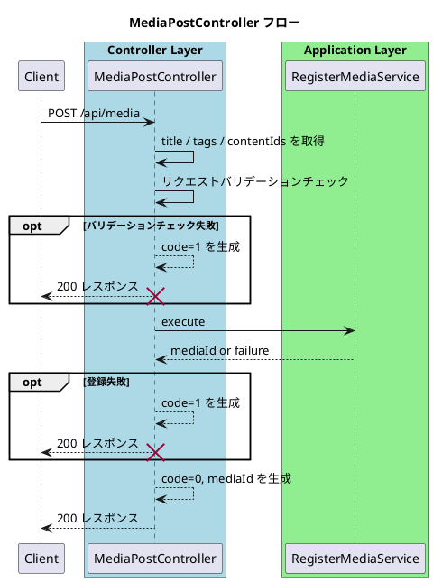

# MediaPostController

## 概要
- `POST /api/media` のHTTPリクエストを受け取り、メディア登録ユースケースへ橋渡しする。
- セッション認証およびコンテンツ保存はミドルウェアで完了している前提で、リクエストコンテキストの `contentIds` と入力値（`title` / `tags`）から登録入力を組み立て、`RegisterMediaService` を呼び出してAPIレスポンス（成功 / 失敗）を整形する。
- `contentIds` は1件以上存在することを前提とする。

## 対象API
- `POST /api/media`

## バリデーション
- `title` は空文字を許可しない。
- `tags` は空配列を許可する。
- `tags` の未指定は許可する（未指定には `null` を含む）。
- `tags` 配列要素に `null` は許可しない。
- `tags[n].category` は空文字を許可しない。
- `tags[n].label` は空文字を許可しない。

## 依存
- SessionAuthMiddleware: `doc/5_api/controller/middleware/SessionAuthMiddleware.md`
- ContentSaveMiddleware: `doc/5_api/controller/middleware/ContentSaveMiddleware.md`
- Application Service: `RegisterMediaService`

## 処理フロー

## エラーハンドリング
- 入力不正や登録失敗: `200` + `code: 1`（Controller / Application）
- 永続化失敗: `200` + `code: 1`（Application）

## 関連ドキュメント
- SessionAuthMiddleware: `doc/5_api/controller/middleware/SessionAuthMiddleware.md`
- ContentSaveMiddleware: `doc/5_api/controller/middleware/ContentSaveMiddleware.md`
- OpenAPI: `doc/5_api/openapi/paths/api/media.yaml`
- シーケンス図: `doc/5_api/sequence/api/media.post.puml`
- APIテストケース: `doc/5_api/testcase/api/media.post.md`
- Application設計: `doc/4_application/media/command/RegisterMediaService/readme.md`
