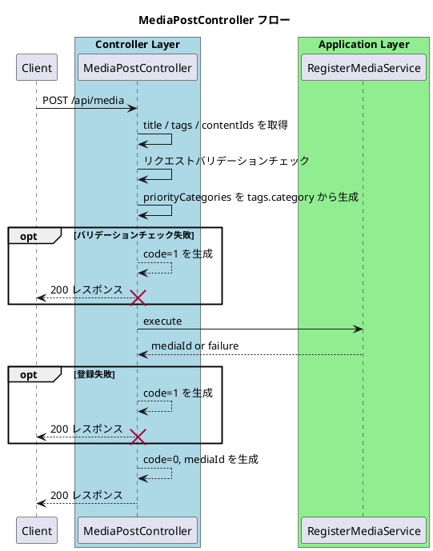

# MediaPostController

## 概要
- `POST /api/media` のHTTPリクエストを受け取り、メディア登録ユースケースへ橋渡しする。
- セッション認証およびコンテンツ保存はミドルウェアで完了している前提で、リクエストコンテキストの `contentIds` と `request.context.userId`、入力値（`title` / `tags`）から登録入力を組み立て、`RegisterMediaService` を呼び出してAPIレスポンス（成功 / 失敗）を整形する。`contentIds` は `contents[n].position` 順に並んでいるものを受け取る。
- `RegisterMediaServiceInput.priorityCategories` は `tags[n].category` から生成する。重複は除去し、先頭から見た出現順を維持する。
- `contentIds` は1件以上存在し、要素は `string` かつ空文字ではなく、重複しないことを前提とする。

## 対象API
- `POST /api/media`

## バリデーション
- `title` は `string` かつ空文字以外であること。
- `tags` は配列であり、要素数は0以上であること。
- `tags` の各要素は `{ category: string, label: string }` 構造であり、`category` / `label` は空文字以外であること。
- `tags` は同一 `category` + `label` の重複を許可する。
- `contentIds` は配列であり、要素数は1以上であること。
- `contentIds` の各要素は `string` かつ空文字以外であること。
- `contentIds` は重複を許可しない。
- `contentIds` の順序は `contents[n].position` の順序と一致していること。
- `request.context.userId` は `string` かつ空文字以外であること（SessionAuthMiddleware設定値）。

## 依存
- [SessionAuthMiddleware](/doc/5_api/controller/middleware/SessionAuthMiddleware/readme.md)
- [ContentSaveMiddleware](/doc/5_api/controller/middleware/ContentSaveMiddleware/readme.md)
- [RegisterMediaService](/doc/4_application/media/command/RegisterMediaService/readme.md)

## 処理フロー

## エラーハンドリング
- 入力不正や登録失敗: `200` + `code: 1`（Controller / Application）
- 永続化失敗: `200` + `code: 1`（Application）

## 関連ドキュメント
- [OpenAPI](/doc/5_api/openapi/paths/api/media.yaml)
- [Controllerテストケース](/doc/5_api/controller/api/MediaPostController/testcase.medium.md)
