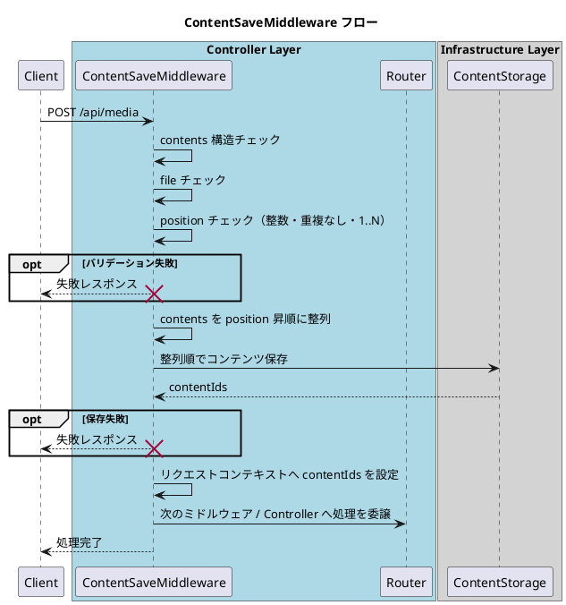

# ContentSaveMiddleware

## 概要
- `POST /api/media` の `multipart/form-data` に含まれる `contents` を検証・保存するミドルウェア。
- `contents[].position` を基準にコンテンツ順を確定し、保存後の `contentIds` を同順序でリクエストコンテキストへ設定する。
- 入力不正または保存失敗時は失敗レスポンスを返し、後続のControllerは実行しない。

## 入出力仕様
### 入力
- リクエストボディ: `multipart/form-data`
- 対象フィールド: `contents`
  - 配列であること。
  - 1件以上存在すること。
  - 各要素は `file` と `position` を持つこと。

### 出力（成功時）
- リクエストコンテキストへ `contentIds: string[]` を設定する。
- `contentIds[n]` は `contents` を `position` 昇順で並べた `n` 番目要素に対応する。

## バリデーション
### file ルール
- `contents[].file` は1件以上必要。
- `file` が未指定・空扱い（実体なし）の要素は不正とみなす。

### position ルール
- `contents[].position` は整数であること。
- `position` は `1, 2, 3, ...` の連番で存在すること。
- `1, 2, 4` のような欠番は不正。
- `2, 3, 4` のように `1` 始まりでない値は不正。
- 重複値は不正。
- 受信順が `2, 1, 3` のように不規則でも、`1..N` を満たす場合は有効（保存時に `position` 昇順へ正規化する）。

## 処理フロー

## エラーハンドリング
- 以下の場合は失敗レスポンスを返し、後続のControllerへ進めない。
  - `contents` が未指定 / 配列でない / 空配列。
  - `file` が0件（空）または不正。
  - `position` が不正（型不一致、重複、欠番、`1` 始まりでない）。
  - コンテンツ保存処理で失敗。
- レスポンス形式・ステータスコードはAPI共通の失敗レスポンス規約に従う。
