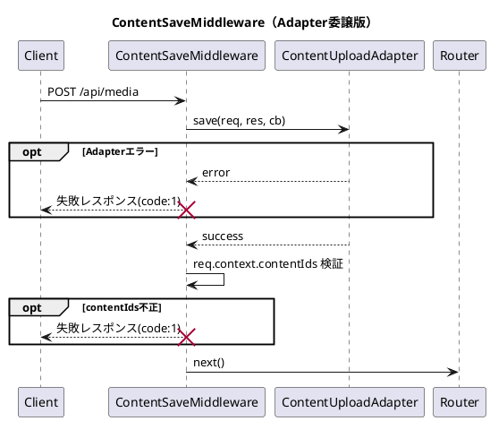

# ContentSaveMiddleware

## 概要
- `POST /api/media` のアップロード処理を `ContentUploadAdapter` に委譲するミドルウェア。
- Adapter 実行後、`req.context.contentIds` の妥当性を検証する。
- `contentIds` が有効な場合のみ後続の Controller へ委譲する。
- Adapterエラーや検証失敗時は失敗レスポンスを返し、後続は実行しない。

## 入出力仕様
### 入力
- `contentUploadAdapter.save(req, res, cb)` を実装した依存。
- `req` / `res` は Express のオブジェクト。

### 出力（成功時）
- `req.context.contentIds: string[]` が存在し、以下を満たすこと。
  - 1件以上
  - 各要素が空でない文字列
  - 重複なし
- `next()` で後続処理へ委譲する。

## 処理フロー

## エラーハンドリング
- 以下の場合は `200` + `code: 1` を返す。
  - `contentUploadAdapter.save` がエラーを返した場合。
  - `req.context.contentIds` が未設定 / 配列以外 / 空配列の場合。
  - `contentIds` 要素が空文字列を含む場合。
  - `contentIds` に重複がある場合。
